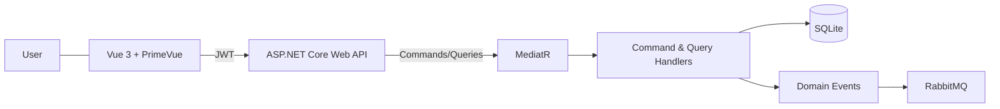

# Agenda — CQRS • JWT • RabbitMQ • Vue 3 • Docker

Aplicação de **Agenda de Contatos**:

- Backend em **.NET 8 Web API**
- **CQRS** com **MediatR**
- **JWT** com roles e policies
- **Entity Framework Core** (SQLite)
- **AutoMapper**, **FluentValidation**
- **RabbitMQ** para mensageria assíncrona
- Testes de backend com **xUnit**, **Moq**, **FluentAssertions** e **TestServer**
- Frontend em **Vue 3 + Vite + PrimeVue**
- Testes de frontend com **Vitest** + **@vue/test-utils**
- Execução completa com **Docker Compose**

---

## Estrutura do Projeto

```text
agenda-cqrs-jwt-docker/
│
├── backend/
│   ├── Agenda.Api/          → Web API .NET 8
│   ├── Agenda.Api.Tests/    → Testes de backend
│   └── Dockerfile
│
├── frontend/
│   ├── src/                 → Código Vue 3
│   ├── tests/               → Testes de frontend (Vitest)
│   └── Dockerfile
│
└── docker-compose.yml       → Orquestra API, Frontend e RabbitMQ
```

---

## Arquitetura — Visão Geral

### Fluxo alto nível



---

## Backend (.NET 8)

### Principais tecnologias

- **ASP.NET Core Web API**
- **CQRS** com **MediatR**
- **Entity Framework Core** (SQLite)
- **AutoMapper**
- **FluentValidation**
- **JWT** com roles/policies
- **Swagger** com suporte a Bearer Token
- **RabbitMQ.Client** para mensageria

### Camadas / Organização

- `Controllers` – expõem endpoints REST (`AuthController`, `ContactsController`)
- `Application/Cqrs/Contacts`
  - `Commands` / `Queries`
  - `Handlers`
  - `Events` (ex.: `ContactCreatedEvent`, `ContactFavoritedEvent`)
- `Application/Dtos` – objetos de transporte (Request/Response)
- `Application/Validation` – FluentValidation para DTOs de entrada
- `Application/Security` – geração de JWT (`IJwtTokenService`)
- `Domain/Entities` – entidades de domínio (`Contact`)
- `Domain/Interfaces` – contratos de repositorios
- `Infrastructure/Data` – `AgendaDbContext`, repositórios EF Core
- `Infrastructure/Messaging` – `IRabbitMqPublisher`, `RabbitMqPublisher`
- `Program.cs` – configuração de DI, autenticação, autorização, Swagger, EF, MediatR, etc.

### Entidade Contact

```csharp
public class Contact
{
    public Guid Id { get; set; } = Guid.NewGuid();
    public string Nome { get; set; } = string.Empty;
    public string Email { get; set; } = string.Empty;
    public string Telefone { get; set; } = string.Empty;
    public bool Ativo { get; set; } = true;
    public bool Favorito { get; set; } = false;
    public DateTime CriadoEm { get; set; } = DateTime.UtcNow;
    public DateTime? AtualizadoEm { get; set; }
}
```

- Index único em `Email`
- `Favorito` com default `false`
- Repositório ordena **favoritos primeiro, depois nome**.

---

## Autenticação e Autorização (JWT + Roles)

### Usuários de demonstração (em memória)

| Usuário | Senha      | Role  | Observação                   |
|--------|------------|-------|------------------------------|
| admin  | P@ssw0rd   | Admin | Acesso total à agenda        |
| user   | P@ssw0rd   | User  | Não possui acesso ao CRUD    |

- Autenticação em: `POST /api/auth/login`
- Gera JWT com claims de role.
- `ContactsController` é protegido por `[Authorize(Policy = "AdminOnly")]`.

---

## CQRS e Fluxos de Contato

### Commands & Queries

- `CreateContactCommand`
- `UpdateContactCommand`
- `DeleteContactCommand`
- `ToggleFavoriteContactCommand`
- `GetAllContactsQuery`
- `GetContactByIdQuery`

### Eventos de domínio

- `ContactCreatedEvent`
- `ContactFavoritedEvent`

### Handlers de eventos

- `ContactCreatedEventHandler`
  - Publica o contato criado em `agenda.contacts.created` no RabbitMQ.
- `ContactFavoritedEventHandler`
  - Publica o contato favoritado em `agenda.contacts.favorited`.

---

## RabbitMQ

Configuração em `appsettings.json`:

```json
"RabbitMq": {
  "HostName": "rabbitmq",
  "UserName": "guest",
  "Password": "guest",
  "Port": 5672,
  "Queues": {
    "ContactCreated": "agenda.contacts.created",
    "ContactFavorited": "agenda.contacts.favorited"
  }
}
```

Docker Compose sobe:

- Serviço `rabbitmq` com imagem `rabbitmq:3-management`
- Painel de administração:
  - URL: http://localhost:15672
  - Usuário: `guest`
  - Senha: `guest`

Filas utilizadas:

- `agenda.contacts.created`
- `agenda.contacts.favorited`

---

## Funcionalidade de Favoritos

### Backend

- Campo `Favorito` na entidade `Contact`.
- `ToggleFavoriteContactCommand` + `ToggleFavoriteContactCommandHandler`
- Endpoint:

```http
PATCH /api/contacts/{id}/favorite
```

- Ao favoritar/desfavoritar:
  - Atualiza o contato no banco.
  - Publica `ContactFavoritedEvent` via MediatR.
  - Handler envia mensagem JSON para a fila `agenda.contacts.favorited`.

### Frontend

- Tabela possui coluna com estrela (`FavoriteStar.vue`).
- Clique na estrela dispara `@toggle` → `toggleFavorite` via API.
- Favoritos aparecem no topo por ordem de nome.
- Dashboard exibe contagem de favoritos.

### Filtro “Mostrar só favoritos”

Na tela de contatos:

- Botão “Mostrar só favoritos”:
  - Quando ativo, apenas contatos favoritos são exibidos.
  - Texto indica `(Mostrando apenas favoritos)`.
  - Contador mostra quantos contatos estão sendo exibidos no filtro atual.

Implementação simplificada:

```js
const showOnlyFavorites = ref(false);

const filteredContacts = computed(() => {
  if (!showOnlyFavorites.value) return contacts.value;
  return contacts.value.filter(c => c.favorito);
});

function toggleOnlyFavorites() {
  showOnlyFavorites.value = !showOnlyFavorites.value;
}
```

---

## Frontend (Vue 3 + Vite + PrimeVue)

### Tecnologias

- **Vue 3 (Composition API)**
- **Vite**
- **PrimeVue** (DataTable, Dialog, Button, Toast, etc.)
- **PrimeIcons**
- Axios com interceptor de JWT

### Componentes principais

- `views/LoginView.vue`
  - Tela com layout moderno (glassmorphism, gradiente)
  - Demonstra credenciais de teste
- `views/ContactsView.vue`
  - Navbar (`Navbar.vue`)
  - Dashboard com cards (`DashboardCard.vue`)
  - Filtro “Mostrar só favoritos”
  - Tabela de contatos (`ContactTable.vue`)
  - Formulário de contato (`ContactForm.vue`)
- `components/contacts/FavoriteStar.vue`
  - Ícone de estrela (favorito / não favorito)

### UX/UI

- Tema dark com gradiente
- Cards em vidro (glass effect)
- Skeleton loading na lista
- Toasts de sucesso/erro
- Ordenação automática com favoritos primeiro
- Filtro rápido de favoritos

---

## Testes

### Backend (xUnit)

Rodar:

```bash
cd backend
dotnet test
```

Principais testes:

- `CreateContactCommandHandlerTests`
  - Criação com sucesso
  - Validação de e-mail duplicado
- `AuthControllerTests`
  - Login válido gera token
  - Login inválido retorna UNAUTHORIZED
- `ToggleFavoriteContactCommandHandlerTests`
  - Toggle de `Favorito` de false → true
  - Não altera nada quando contato não existe
- `ContactsControllerIntegrationTests`
  - Teste de integração com `WebApplicationFactory<Program>`
  - Flow completo:
    - Login
    - Criação de contato
    - `PATCH /api/contacts/{id}/favorite`
    - Verifica que `Favorito` passou a `true`

### Frontend (Vitest)

Rodar:

```bash
cd frontend
npm install
npm test
```

Principais testes:

- `ContactForm.spec.js`
  - Validação de campos obrigatórios
- `FavoriteStar.spec.js`
  - Renderização da estrela cheia/vazia
  - Emissão de evento `toggle` ao clicar
- `ContactTable.spec.js`
  - Monta tabela com um contato
  - Clica na estrela e verifica emissão de `toggleFavorite`

---

## Execução com Docker

Pré-requisitos:

- Docker
- Docker Compose

Na raiz do projeto:

```bash
docker compose up --build
```

Serviços:

| Serviço    | URL                       |
|-----------|---------------------------|
| Frontend  | http://localhost:5173     |
| API       | http://localhost:5000     |
| Swagger   | http://localhost:5000/swagger |
| RabbitMQ  | http://localhost:15672    |
